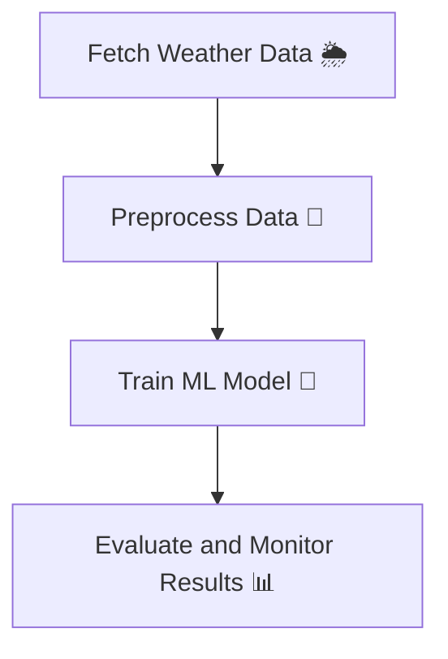

# **Weather Forecasting with MLOps: DVC, Airflow, and MLFlow** 🌦️🚀

This repository demonstrates a complete end-to-end **MLOps pipeline** for building a weather forecasting model. By leveraging tools like **DVC**, **Airflow**, and **MLFlow**, we’ve created an automated, scalable, and reproducible workflow for collecting data, training models, and monitoring performance.

---

## **Table of Contents**
1. [Project Overview](#project-overview)
2. [Features](#features)
3. [Architecture](#architecture)
4. [Getting Started](#getting-started)
5. [Usage](#usage)
6. [MLFlow Integration](#mlflow-integration)
7. [Key Tools](#key-tools)
8. [Results](#results)
9. [Contributing](#contributing)
10. [License](#license)

---

## **Project Overview** 📖

### **Objective:**
The primary goal of this project is to:
1. Collect live weather data 🌐.
2. Preprocess and clean the data 🧹.
3. Train machine learning models to predict weather conditions 🤖.
4. Automate workflows for scalability and reproducibility ⚙️.
5. Track models and experiments for easy version control 📊.

This project adopts **MLOps best practices** to ensure a seamless integration of machine learning into production workflows.

---

## **Features** ✨

- **Automated Data Collection**: Fetch real-time weather data using APIs.
- **Data Versioning**: Track datasets with **DVC** to ensure reproducibility.
- **Workflow Automation**: Manage and automate tasks with **Airflow DAGs**.
- **Model Versioning and Experiment Tracking**: Use **MLFlow** for logging experiments and comparing model performance.
- **Scalability**: Modular design for easy extension and deployment.

---

## **Architecture** 🏗️

Here’s an overview of the pipeline architecture:



Each stage is modular and automated using **Airflow**, with **DVC** and **MLFlow** ensuring version control and tracking.

---

## **Getting Started** 🛠️

### **Prerequisites**
- Python 3.8+
- Git
- DVC
- Apache Airflow
- MLFlow

### **Installation**
1. Clone the repository:
   ```bash
   git clone https://github.com/your-repo/weather-mlops.git
   cd weather-mlops
   ```

2. Install dependencies:
   ```bash
   pip install -r requirements.txt
   ```

3. Initialize DVC:
   ```bash
   dvc init
   ```

4. Configure Airflow:
   ```bash
   airflow db init
   airflow users create --username admin --password admin --firstname Admin --lastname User --role Admin --email admin@example.com
   ```

---

## **Usage** 🏃‍♀️

### **1. Fetch Weather Data**
Use the provided Python script to fetch live weather data:
```bash
python fetch_data.py --api_key YOUR_API_KEY --city "New York"
```

### **2. Run the Airflow Pipeline**
Activate the Airflow scheduler and webserver:
```bash
airflow scheduler
airflow webserver
```
Access the Airflow UI at `http://localhost:8080`, enable the DAG, and watch the pipeline run! 🎡

### **3. Train and Track Models**
Train models while logging parameters and metrics to MLFlow:
```bash
python train_model.py
```
Launch the MLFlow UI to view experiment results:
```bash
mlflow ui
```
Access it at `http://localhost:5000`.

---

## **MLFlow Integration** 📋

### **Overview:**
MLFlow is integrated into the pipeline for:
- Logging model parameters (e.g., learning rate, batch size).
- Tracking metrics (e.g., accuracy, RMSE).
- Managing model versions and artifacts.
- Comparing experiment results.

### **Logging Model Experiments:**
Here’s how the pipeline logs experiments to MLFlow:
1. **Initialization**:
   MLFlow is initialized with a remote tracking URI or a local directory.
   ```python
   import mlflow
   mlflow.set_tracking_uri("http://localhost:5000")
   mlflow.set_experiment("Weather Forecasting")
   ```

2. **Logging Parameters and Metrics**:
   During training, parameters (e.g., hyperparameters) and metrics (e.g., validation accuracy) are logged:
   ```python
   with mlflow.start_run():
       mlflow.log_param("learning_rate", 0.001)
       mlflow.log_metric("rmse", 2.3)
   ```

3. **Storing Artifacts**:
   Model artifacts (e.g., trained model files) are saved and versioned:
   ```python
   mlflow.log_artifact("models/weather_model.pkl")
   ```

4. **Model Registry**:
   The best-performing model is promoted to production:
   ```python
   mlflow.register_model("models:/WeatherModel/production", "weather_model")
   ```

### **MLFlow UI**:
The MLFlow UI provides a comprehensive interface to:
- Compare experiments.
- Visualize metrics.
- Manage model versions.

To launch the UI:
```bash
mlflow ui
```
Access it at `http://localhost:5000`.

---

## **Key Tools** 🛠️

1. **DVC**: Tracks datasets and models, ensuring reproducibility.
2. **Airflow**: Automates pipeline tasks.
3. **MLFlow**: Logs and tracks experiments, parameters, and artifacts.
4. **Weather API**: Provides live weather data.
5. **Scikit-learn**: Used for model training.

---

## **Results** 📊

The pipeline outputs include:
- **Cleaned Datasets**: Version-controlled and stored using DVC.
- **Trained Models**: Versioned with DVC for reproducibility.
- **Experiment Logs**: Detailed metrics, parameters, and artifacts tracked using MLFlow.
- **Automated Pipeline**: Tasks run seamlessly using Airflow.

---

## **Contributing** 🤝

Contributions are welcome! Please follow these steps:
1. Fork the repository.
2. Create a new branch:
   ```bash
   git checkout -b feature-branch
   ```
3. Commit your changes:
   ```bash
   git commit -m "Add feature"
   ```
4. Push to the branch:
   ```bash
   git push origin feature-branch
   ```
5. Submit a pull request.

---

## **License** 📜

This project is licensed under the [MIT License](LICENSE). Feel free to use and modify it as you like. 🎉

---

## **Let’s Connect!** 🌍

If you found this project helpful, feel free to:
- 🌟 Star the repo!

Happy coding! 🚀
