# **Weather Forecasting with MLOps: DVC, Airflow, and MLFlow** 🌦️🚀

This repository demonstrates a complete end-to-end **MLOps pipeline** for building a weather forecasting model. By leveraging tools like **DVC**, **Airflow**, and **MLFlow**, we’ve created an automated, scalable, and reproducible workflow for collecting data, training models, and monitoring performance.  

---

## **Table of Contents**
1. [Project Overview](#project-overview)
2. [Features](#features)
3. [Architecture](#architecture)
4. [Getting Started](#getting-started)
5. [Usage](#usage)
6. [Key Tools](#key-tools)
7. [Results](#results)
8. [Contributing](#contributing)
9. [License](#license)

---

## **Project Overview** 📖

### **Objective:**
The primary goal of this project is to:
1. Collect live weather data 🌐.
2. Preprocess and clean the data 🧹.
3. Train machine learning models to predict weather conditions 🤖.
4. Automate workflows for scalability and reproducibility. ⚙️
5. Track models and experiments for easy version control. 📊

This project adopts **MLOps best practices** to ensure a seamless integration of machine learning into production workflows.

---

## **Features** ✨

- **Automated Data Collection**: Fetch real-time weather data using APIs.
- **Data Versioning**: Track datasets with **DVC** to ensure reproducibility.
- **Workflow Automation**: Manage and automate tasks with **Airflow DAGs**.
- **Model Versioning and Experiment Tracking**: Use **MLFlow** for logging experiments and comparing model performance.
- **Scalability**: Modular design for easy extension and deployment.

---

## **Architecture** 🏗️

Here’s an overview of the pipeline architecture:

```mermaid
graph TD;
    A[Fetch Weather Data 🌦️] --> B[Preprocess Data 🧹]
    B --> C[Train ML Model 🤖]
    C --> D[Evaluate and Monitor Results 📊]
```



Each stage is modular and automated using **Airflow**, with **DVC** and **MLFlow** ensuring version control and tracking.

---

## **Getting Started** 🛠️

### **Prerequisites**
- Python 3.8+
- Git
- DVC
- Apache Airflow
- MLFlow

### **Installation**
1. Clone the repository:
   ```bash
   git clone https://github.com/your-repo/weather-mlops.git
   cd weather-mlops
   ```

2. Install dependencies:
   ```bash
   pip install -r requirements.txt
   ```

3. Initialize DVC:
   ```bash
   dvc init
   ```

4. Configure Airflow:
   ```bash
   airflow db init
   airflow users create --username admin --password admin --firstname Admin --lastname User --role Admin --email admin@example.com
   ```

---

## **Usage** 🏃‍♀️

### **1. Fetch Weather Data**
Use the provided Python script to fetch live weather data:
```bash
python fetch_data.py --api_key YOUR_API_KEY --city "New York"
```

### **2. Run the Airflow Pipeline**
Activate the Airflow scheduler and webserver:
```bash
airflow scheduler
airflow webserver
```
Access the Airflow UI at `http://localhost:8080`, enable the DAG, and watch the pipeline run! 🎡

### **3. Train and Track Models**
Train models while logging parameters and metrics to MLFlow:
```bash
python train_model.py
```
Launch the MLFlow UI to view experiment results:
```bash
mlflow ui
```
Access it at `http://localhost:5000`.

---

## **Key Tools** 🛠️

1. **DVC**: Tracks datasets and models, ensuring reproducibility.
2. **Airflow**: Automates pipeline tasks.
3. **MLFlow**: Logs and tracks experiments.
4. **Weather API**: Provides live weather data.
5. **Scikit-learn**: Used for model training.

---

## **Results** 📊

The pipeline outputs include:
- **Cleaned Datasets**: Version-controlled and stored using DVC.
- **Trained Models**: Versioned with DVC for reproducibility.
- **Experiment Logs**: Detailed metrics, parameters, and artifacts tracked using MLFlow.
- **Automated Pipeline**: Tasks run seamlessly using Airflow.

---

## **Contributing** 🤝

Contributions are welcome! Please follow these steps:
1. Fork the repository.
2. Create a new branch:
   ```bash
   git checkout -b feature-branch
   ```
3. Commit your changes:
   ```bash
   git commit -m "Add feature"
   ```
4. Push to the branch:
   ```bash
   git push origin feature-branch
   ```
5. Submit a pull request.

---

## **License** 📜

This project is licensed under the [MIT License](LICENSE). Feel free to use and modify it as you like. 🎉

---

## **Let’s Connect!** 🌍

If you found this project helpful, feel free to:
- 🌟 Star the repo!

Happy coding! 🚀
